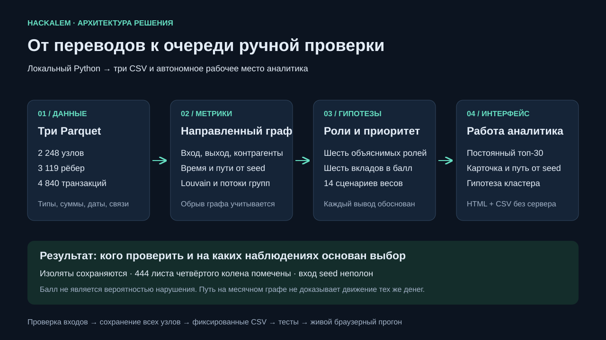

# AML — объяснимый анализ графа переводов

Инструмент для AML-аналитика: из трёх Parquet строит роли, сообщества и приоритеты проверки, затем показывает операции, цепочки, ограничения наблюдения и следующий запрос данных. Только исходная обезличенная выборка, CPU, локальный Python; внешние клиентские атрибуты не добавляются. Роли и scores — гипотезы, не выводы о виновности.

## Подготовка на любой ОС

Скопируйте **весь проект, включая `data/` и `vendor/`, но без `.venv/`**. При переносе через GitHub сначала отправьте актуальные изменения, затем клонируйте или скачайте репозиторий. `starter/` — исходный каркас организаторов с незаполненными ролями; запускайте решение из корня, а не `starter/starter.py`.

Установите **64-битный CPython 3.11** для своего процессора. Python в комплект проекта не входит. Офлайн-пакеты включены для macOS 12+ Intel/Apple Silicon, Windows x64 и Linux x86-64/ARM64 с glibc ≥2.17. Установщик создаёт `.venv` и использует `--no-index`: при наличии Python и полного `vendor/` интернет не нужен. Нативные Windows ARM, 32-битные ОС, Alpine/musl и другие версии Python этим комплектом не поддерживаются.

Ниже замените пример пути на папку, где находится `README.md` и `run_pipeline.py`. Все команды запуска выполняются из этой папки. Активация `.venv` вручную не требуется.

## Запуск на macOS

Откройте **Terminal**. Убедитесь, что установлен CPython 3.11 для Intel или Apple Silicon, затем выполните:

```bash
cd "/путь/к/hackalem"
python3.11 --version
sh run.sh --serve
```

Последняя команда устанавливает локальные зависимости при необходимости, выполняет весь расчёт и запускает сайт. Откройте [http://127.0.0.1:8765/graph.html](http://127.0.0.1:8765/graph.html). Терминал должен оставаться открытым; остановка — **Ctrl+C**.

Только пересчёт без сервера: `sh run.sh`. Диагностика: `python3.11 launch.py --doctor`. Если порт занят: `sh run.sh --serve --port 8766`, затем откройте [порт 8766](http://127.0.0.1:8766/graph.html).

## Запуск на Windows

Установите **CPython 3.11 x64** вместе с Python Launcher (`py`). Откройте **PowerShell** в папке проекта:

```powershell
Set-Location "C:\путь\к\hackalem"
py -3.11 --version
.\run.bat --serve
```

Откройте [http://127.0.0.1:8765/graph.html](http://127.0.0.1:8765/graph.html). Остановить сервер — **Ctrl+C**. В обычном `cmd` вместо `Set-Location` используйте `cd /d "C:\путь\к\hackalem"`; команда `.\run.bat --serve` та же.

Только пересчёт: `.\run.bat`. Диагностика: `py -3.11 launch.py --doctor`. Другой порт: `.\run.bat --serve --port 8766`. Если `py` не найден, но команда `python --version` показывает **3.11**, можно выполнить `python launch.py --serve`.

## Запуск на Linux

Нужны **CPython 3.11**, модули `venv` и `ensurepip`, а также glibc ≥2.17; процессор — x86-64 или ARM64. В дистрибутивах, где venv поставляется отдельно, установите пакет venv именно для своего Python 3.11 до запуска проекта. Откройте терминал:

```bash
cd "/путь/к/hackalem"
python3.11 --version
python3.11 -c "import venv, ensurepip"
sh run.sh --serve
```

Откройте [http://127.0.0.1:8765/graph.html](http://127.0.0.1:8765/graph.html). Остановить сервер — **Ctrl+C**.

Только пересчёт: `sh run.sh`. Диагностика: `python3.11 launch.py --doctor`. Другой порт: `sh run.sh --serve --port 8766`. В Alpine/musl используйте подготовленный Docker-вариант или отдельно совместимое окружение — включённые manylinux-пакеты для него не подходят.

## Результаты запуска и типичные проблемы

После расчёта файлы находятся в `output/`: обязательные `nodes_roles.csv`, `clusters.csv`, `top_nodes.csv`, а также `graph.html`, метрики и отчёты. Единая точка входа — `launch.py`; `--data`, `--out`, `--top` используются только для пакетного режима без `--serve`. Например: `python3.11 launch.py --data data --out output --top 30` (Windows: `py -3.11 launch.py ...`). Минимальное значение top — 20.

| Ситуация | Действие |
|---|---|
| Python не найден или версия не 3.11 | Установить CPython 3.11; проверить командой для своей ОС выше |
| Ошибка venv/ensurepip в Linux | Установить компонент venv для Python 3.11 |
| Порт 8765 занят | Остановить прежний сервер Ctrl+C или использовать `--port 8766` |
| Нет или повреждены wheel-пакеты | Скопировать весь `vendor/` вместе с manifest.json; не переносить выборочные файлы |
| `.venv` перенесена с другого компьютера | Переименовать её и повторить запуск; установщик создаст новое окружение |
| Старая страница после ручного пересчёта | Обновить вкладку: macOS Cmd+Shift+R, Windows/Linux Ctrl+F5; проверить адрес и порт |
| Нужно только посмотреть готовый результат | Открыть `output/graph.html` браузером без Python |

Полный расчёт занимает около **2 секунд** в подготовленном окружении на текущем Mac; установка зависимостей и первичная загрузка библиотек могут занять дольше. Точное время расчёта записывается в `output/run_report.json`.

**Пределы проверки:** настоящий запуск и чистая офлайн-установка проверены на macOS arm64. Для Windows/Linux/Intel Mac включены пакеты, проверены SHA-256 и логика выбора платформы; фактический запуск на этих ОС здесь не выполнялся. Дополнительные инструкции: [docs/PORTABILITY.md](docs/PORTABILITY.md), [docs/OFFLINE.md](docs/OFFLINE.md).

## Интерфейс и автообновление

Файл `output/graph.html` содержит данные и JavaScript: его можно открыть отдельно, без CDN, сервера и Python. Это просмотр результата последнего расчёта, а не пересчёт Parquet. Для надёжного хранения истории дел используйте HTTP-сервер — поведение localStorage на file:// зависит от браузера.

`--serve` пересобирает результат при изменении кода/Parquet и обновляет вкладку. Несохранённый комментарий блокирует автоматическое обновление. Старый `python -m http.server` только отдаёт файлы и не пересобирает проект.

Сценарий: выбрать приоритетный узел или найти gid → изучить окружение и стрелки → открыть карточку → проверить операции и путь от seed → сохранить решение и экспортировать справку/запрос. Цвет обозначает роль, размер — приоритет, белая обводка — seed. Колесо меняет масштаб, перетаскивание перемещает схему. Топ остаётся видимым при выборе узла. Есть фильтры роли и сообщества, режим соседей, отдельный путь от seed, навигация по топу и скачивание текстовой карточки. Геометрическое расстояние не является финансовой метрикой.

В разделе «Аналитика и помощник» находятся сообщества с гипотезами, паттерны, чувствительность порогов, удаление top-N и локальный помощник. Он понимает ограниченный набор вопросов («кого смотреть первым», «почему gid», «кто собирает деньги с gid1 gid2», «путь от seed к gid», «каких данных не хватает»). Ответы вычисляются по графу и содержат переходы к узлам. **Это помощник на правилах, без LLM**, а не универсальный AI-чат. Неизвестные вопросы/узлы явно отклоняются; идентичности и виновность не выводятся.

## Запуск через Docker

Альтернатива установке Python — установленный Docker с Compose и Linux-контейнерами. Из корня проекта:

```bash
docker compose up --build
```

Откройте [сайт](http://127.0.0.1:8765/graph.html). Python находится внутри контейнера. Первая загрузка базового образа требует интернета, если образ ещё не закэширован; Python-пакеты устанавливаются из локального комплекта. **Docker-вариант здесь пока не проверен запуском.**

Результаты хранятся в Docker-томе. Скопировать их на компьютер:

```bash
docker compose cp aml:/app/output ./docker-output
```

Остановка: `docker compose down`. Подробности, поддерживаемые платформы и перенос готового Docker-образа без интернета — [docs/PORTABILITY.md](docs/PORTABILITY.md).

## Схема решения и демо



Слайд для защиты: [docs/architecture.svg](docs/architecture.svg). Готовый сценарий на 5 минут: [output/demo.md](output/demo.md). Примеры консолидации, рассылки, границы и транзита выбираются при каждом запуске автоматически, без зашитых gid. Матрица соответствия заданию: [docs/CRITERIA.md](docs/CRITERIA.md). Результаты фактической проверки: [docs/AUDIT.md](docs/AUDIT.md).

## Структура проекта

| Файл | Ответственность |
|---|---|
| `pipeline/load.py` | Схема, типы, NULL, уникальность, даты, порог, сверка агрегатов |
| `pipeline/metrics.py` | Направленные степени, суммы, количество операций, даты, BFS |
| `pipeline/temporal.py` | Сопоставление сумм FIFO в двух сценариях |
| `pipeline/roles.py` | Версия 3.0 правил, scores и evidence |
| `pipeline/clustering.py` | Взвешенный Louvain по компонентам, гипотезы |
| `pipeline/ranking.py` | Приоритет и его объяснение |
| `pipeline/analytics.py` | Аномалии, циклы, маршруты, чувствительность, удаление узлов |
| `pipeline/deliverables.py` | Автоматический выбор примеров для демо |
| `run_pipeline.py` | Последовательность расчёта, контракты, все выгрузки |
| `app/` | Автономный Canvas-интерфейс, карточки, помощник |
| `serve.py` | Локальный сервер с пересборкой |
| `scripts/`, `tests/` | Офлайн-установка и проверки |

## Входные данные и метрики

`nodes.parquet`: gid, depth, is_seed; `edges.parquet`: src, dst, sum_kzt, n_tx, depth; `transactions.parquet`: src, dst, date, sum_kzt. Загрузчик сверяет суммы с точностью 0,01 KZT и n_tx по каждой паре, проверяет неизвестные концы рёбер, уникальность и диапазоны. Отдельные одинаковые транзакции не удаляются: у них нет банковского transaction_id.

- `in_degree`, `out_degree`: число уникальных входящих/исходящих соседей, включая самопереводы. `fan_in`, `fan_out` исключают сам узел: самоперевод не добавляет контрагента.
- `sum_in`, `sum_out`, `n_tx_in`, `n_tx_out`: наблюдаемые суммы и число операций.
- `pass_through_ratio=sum_out/sum_in` при sum_in>0, иначе NULL и `zero_sum_in=True`.
- `volume=sum_in+sum_out`: интенсивность участия; транзитная сумма учитывается на входе и выходе, это не остаток.
- `is_depth4_leaf`: depth=4 и out_degree=0; не доказанный конечный получатель.
- `first_tx`, `last_tx`, `activity_span_hours`: окно активности, не время удержания денег.
- `seed_hops`: направленный BFS от всех seed, 0 для seed, -1 для недостижимого узла; изоляты сохранены.
- `seed_path`: один кратчайший направленный путь; `near_seed_count` / `reachable_seed_count`: число других seed, достигающих узла за ≤2 / ≤4 шага; `seed_branch_count`: число входящих соседей, достижимых от seed за ≤3 шага. Ветви могут иметь общих предков и не означают независимые группы.
- `rapid_out_share`: прежний справочный признак соседства выхода с входом ≤24ч; **не используется для назначения ролей в версии 3**.

Все суммы/связи ограничены выборкой. Неизвестные входы могут отсутствовать у любого узла; у seed это особенно выражено.

## Временной анализ с сохранением сумм

`temporal.py` распределяет наблюдаемые входящие суммы на последующие исходящие по FIFO. Суммы переводятся в копейки, остаток входа уменьшается после каждого сопоставления. В рамках одного узла и одного сценария вход нельзя потратить дважды, выход нельзя покрыть больше его суммы. Исходная позиция `row:N` позволяет проверить каждое сопоставление.

Даты имеют точность до дня, поэтому рассчитываются два сценария:

- `fifo_strict_share`: выходы дня обрабатываются до входов этого дня; сопоставляются только входы за предыдущие 1–2 календарных дня.
- `fifo_same_day_possible_share`: входы дня обрабатываются до выходов; допускается 0–2 календарных дня.

Каждый показатель — сопоставленная сумма / sum_out (0 без выходов). Это **два сценария, а не гарантированные нижняя/верхняя границы**: перераспределение сумм меняет последующие доступные остатки. 0–2 календарных дня не означает точные 48 часов. Начальные остатки неизвестны; FIFO не доказывает, что ушли именно полученные деньги. Между узлами не поддерживается глобальная идентичность средств. Результаты сценариев нельзя складывать.

## Правила ролей и обоснование порогов

Первое выполненное правило определяет основную роль. По умолчанию H=5, L=0,2; Q=P90 объёма всех узлов (на текущих данных **741 811,70 KZT**).

| Порядок | Роль | Правило |
|---:|---|---|
| 1 | terminal на границе | depth4 leaf, sum_in>0; score=0,25 и оговорка об обрыве |
| 2 | coordinator | fan_in≥H, fan_out≥H, большая степень≤2×меньшей, volume≥Q; ≥2 других seed за ≤2 шага и ≥2 входных ветвей; не выполнено правило consolidator |
| 3 | consolidator | не seed; fan_in≥H; ratio≤L |
| 4 | distributor | fan_out≥H; скорость усиливает score, но не отменяет структуру рассылки |
| 5 | transit | не seed; ratio 0,8–1,2 включительно; обе степени>0, большая≤2×меньшей; FIFO 0–2д≥50% |
| 6 | terminal внутри выборки | sum_in>0, fan_out=0; отсутствие выхода только в выборке |
| 7 | peripheral | остальные; отсутствие сигнала, не свидетельство безопасности |

H=5 отделяет ветвление от единичных связей: медианы fan_in/fan_out равны 1/0, P95 — 3/5. L=0,2 означает, что наблюдаемый выход не превышает пятой части входа. ±20% допускает небольшой дисбаланс, фактор 2 ограничивает асимметрию степеней. FIFO≥50% требует поддержки хотя бы половины исходящей суммы. P90 выделяет верхнюю десятую часть объёмов. Для coordinator два близких seed и две ветви требуют пересечения нескольких наблюдаемых потоков; один высокий оборот недостаточен. Все это эвристики, а не обученные пороги; устойчивость проверяется отдельно.

Структурная рассылка и её скорость теперь разделены: узел со 116 получателями не становится peripheral из-за того, что временной показатель чуть ниже 50%. На границе правило обрыва применяется раньше остальных. Для seed не назначаются consolidator/transit по неполному отношению сумм.

### Как считается role_score

Пусть f=fifo_same_day_possible_share, s=fifo_strict_share, r=ratio, V=volume, h=H, q=Q. Все выражения ограничены [0,1]. Score — воспроизводимая сила правила, **не откалиброванная вероятность**.

| Роль | Формула |
|---|---|
| coordinator | 0,65 + 0,15·min(min(fan_in,fan_out)/(2h),1) + 0,10·min(V/(2q),1) |
| consolidator | 0,60 + 0,15·min(fan_in/(2h),1) + 0,15·(1−r/L) |
| distributor | 0,45 + 0,20·min(max(fan_in,fan_out)/(4h),1) + 0,10f + 0,10s |
| transit | 0,50 + 0,15·(1−abs(r−1)/0,2) + 0,10f + 0,10s |
| terminal внутри | 0,50 + 0,15·min(fan_in/h,1) |
| boundary terminal | 0,25 |
| peripheral | 0,40 |

Для seed score≤0,55; для прочих узлов с нулевым входом score≤0,50. Evidence содержит числа и укладывается в 200 символов; полное сработавшее правило (`rule_code`, `rule_text`) доступно в метриках и карточке. В сценариях чувствительности знаменатель 0,2 у transit заменяется соответствующим допуском.

## Кластеризация и гипотезы

NetworkX Louvain: weight=sum_kzt, resolution=1, seed=42. Неориентированная проекция суммирует встречные направления. Каждый компонент обрабатывается отдельно; изоляты получают отдельные сообщества. Направления сохраняются во всех остальных расчётах. Нумерация по минимальному gid обеспечивает повторяемость при одинаковом входе.

В гипотезе кластера показаны признаки сбора, распределения и транзита, количество seed, суммы внутри и через границу, крупнейшие получатели, концентрация внутреннего потока и количество обрывов depth4. Внутренняя доля = внутренние переводы / (внутренние + входящие через границу + исходящие через границу). Отдельно приводится доля внутреннего потока среди исходящих переводов участников. Изолятам не приписывается назначение. Эти доли не означают удержание денег на счетах.

В текущем графе **16 компонент с рёбрами + 19 изолированных seed = 35 компонент**. Получается 105 сообществ, 8 из них содержат несколько seed. Это не единственно возможное разбиение; изменение resolution влияет на результат. Устойчивость Louvain по resolution пока отдельно не измеряется.

## Приоритет и объяснение

```text
priority_score = 0,15 × вес_роли × role_score
               + 0,25 × norm(volume)
               + 0,25 × norm(fan_in+fan_out)
               + 0,10 × 1/(1+seed_hops)
               + 0,10 × norm(reachable_seed_count)
               + 0,15 × norm(fan_in) × retention
norm(x) = log1p(x) / max(log1p(x))
retention = clip(1-pass_through_ratio, 0, 1)
```

Веса ролей: coordinator 1; consolidator 0,95; distributor 0,75; transit 0,65; terminal 0,45; peripheral 0,10. При нулевом максимуме нормированное слагаемое равно 0; для недостижимого узла близость=0. Для seed, depth4 leaf и неопределённого ratio retention=0: неполные данные не дают бонуса накопления. Сумма ≤1. Сортировка score по убыванию, затем gid по возрастанию. `why` содержит шесть вкладов, правило, число транзакций и дополнительные сигналы. Аномалии не добавляют скрытых надбавок к приоритету. Баллы разных выгрузок напрямую несопоставимы из-за нормирования.

`ranking_sensitivity.csv` содержит 14 сценариев весов: база, каждый из шести весов ±20% с перенормированием суммы к 1 и контроль без роли. `rank_min` / `rank_max` — диапазон по этим сценариям. Отдельные `threshold_rank_min` / `threshold_rank_max`, `role_stability`, `top20_frequency` относятся к изменению порогов ролей в `stability.parquet`. Устойчивость не равна accuracy.

## Дополнительные аналитические функции

- **Короткие циклы:** все найденные направленные простые циклы длины 2–4 внутри сильносвязных компонент; лимит 2000 с явным `cycles_truncated`. Самопереводы не считаются циклом расследования. На текущих данных 387, лимит не достигнут. Хронология и возврат одной суммы не доказаны.
- **Повторные маршруты A→B→C:** в strict FIFO есть ≥2 разных входящих и ≥2 разных исходящих операций по этой тройке; все три узла различны. Сейчас 26 кандидатов. Это повторные сопоставления сумм, не подтверждённые маршруты одних денег.
- **Всплеск:** ≥5 входящих/исходящих событий за день и ≥50% событий узла за месяц приходится на этот день.
- **Синхронные входы:** ≥3 уникальных плательщиков за один день.
- **Повтор сумм:** ≥3 транзакций одной пары с одинаковой суммой за день. Это сигнал повторения, не доказательство дробления; операции ниже 5000 невидимы.
- **Профиль относительно колена:** одновременно объём и суммарная степень строго выше P95 своего depth, группа≥20 узлов. Ненулевая сумма обязательна. Сравнение описательное, не статистический тест виновности.
- **Чувствительность:** 12 сочетаний H=3/5/8/10 и L=0,1/0,2/0,3 плюс transit-допуск ±15% и ±25% (14 сценариев, включая базовый). Для узла: доля сохранения роли, min/max ранга, доля попадания в top20. Для сценария: совпадение ролей и Jaccard top20. Это устойчивость правил, не accuracy.
- **Удаление top-N:** N=1/5/10/20, слабая связность, крупнейшая компонента, изоляты, доля сохраняющихся связных пар среди тех же оставшихся узлов. Контроль — среднее 20 случайных удалений того же N, seed=42. Симуляция описывает наблюдаемый граф и не прогнозирует эффект банковской блокировки.

## Карточки, решения и запросы данных

Карточка содержит правило, метрики, операции, два сценария FIFO, устойчивость роли, пути от каждого достижимого seed, статус/комментарий и историю. Кнопка пути показывает его узлы и связи на графе. Показанный подграф может содержать дополнительные связи между этими узлами; текст цепочки фиксирует выбранный путь.

Статусы: Новое → Проверяется → Закрыто / Эскалировано (аналитик может менять их повторно). Для закрытия/эскалации нужно основание. «Сохранить решение» добавляет запись с временем, предыдущим/новым статусом, комментарием и версией правил. Старые записи без версии остаются читаемыми.

Хранение — localStorage браузера, по SHA-256 входной выборки и gid. Это персональный локальный прототип, без защищённого аудита, авторизации и совместного редактирования. На file:// хранение зависит от браузера; используйте сервер. Другой origin/браузер/выборка — отдельное состояние. Очищение браузера удалит историю; экспортируйте нужные дела.

Экспорт: справка HTML (печать в PDF), дело JSON с метриками, операциями, историей и отпечатком данных, запросы TXT. Несохранённые изменения помечаются как черновик. Это не регуляторная форма ФМ-1. JSON-импорт не предусмотрен. `row:N` — строка исходного transactions.parquet, а не банковский ID. Gid в браузере/JSON — строки, int64 не теряет точности.

Запросы формируются по наблюдениям: depth4 leaf → дальнейшие исходящие; seed/нулевой вход/ratio>1,2 → полный вход и начальный остаток; вход и выход → точное время и часовой пояс; вход>выход → при разрешённом доступе другие способы вывода; изолят → проверка полноты; всем → период, порог, каналы. Никакие внешние сведения автоматически не загружаются.

## Выходные файлы

Обязательные три CSV в UTF-8, с **точной схемой**:

| Файл | Колонки |
|---|---|
| `nodes_roles.csv` | gid, role, role_score, cluster_id, priority_score, evidence |
| `clusters.csv` | cluster_id, n_nodes, n_seed, sum_kzt_internal, top_gids, hypothesis |
| `top_nodes.csv` | rank, gid, role, priority_score, why |

2248 узлов, 105 кластеров, top30 по умолчанию. `top_gids` — JSON-массив до 5 gid, ранжированных по приоритету. `sum_kzt_internal` учитывает каждое исходное направленное ребро внутри кластера один раз.

Дополнительно в output: `node_metrics.parquet`, `temporal_matches.parquet` (каждое FIFO-сопоставление с row-ссылками), `stability.parquet`, `ranking_sensitivity.csv`, `analytics.json`, `run_report.json` (версии, SHA-256 входов, пороги, время), `graph.html`, `demo.md`, `demo_cases.json`. При запуске проверки также создаётся `validation_report.json`. NULL допустимы только для объективно неопределённых метрик (ratio при нулевом входе, даты изолята); обязательные CSV полностью заполнены.

## Проверки и воспроизводимость

```bash
.venv/bin/python -m unittest discover -s tests -v
.venv/bin/python scripts/verify.py
```

Проверяются границы и seed, изоляты, сверка n_tx, направление времени, запрет повторного расхода FIFO, циклы/маршруты, мост при удалении узла, чувствительность и случай веерного узла со слабым временным сигналом. Интеграционная проверка повторяет расчёт в двух временных директориях, проверяет CSV и сопоставления сумм и сравнивает хеши результатов. Время и версии отражены в отчётах. После объединения версий прошли 28 unit- и регрессионных тестов, интеграционная проверка и браузерные smoke-тесты. Чистая установка без PyPI на macOS arm64 дала те же CSV; полный пересчёт в новом окружении занял 4,93 с. Браузерные проверки — `tests/browser_smoke.cjs` и `tests/live_server_smoke.cjs`; Playwright нужен только для QA, не для работы продукта. Проверены также пересборка, no-store и сохранение несохранённого комментария при обновлении.

## Ограничения

Обрыв на 4 колене; неполный вход seed и других узлов; только один банк и июль 2026; операции <5000 KZT отсутствуют; нет ФИО, ИИН, остатков, назначения платежа и ground truth. Дневная точность не позволяет восстановить порядок внутри дня. «Terminal» означает наблюдаемый конец, не доказанное оседание. Роли и аномалии могут иметь бытовое объяснение. Не рассчитываем accuracy и не выдаём score за вероятность нарушения. Помощник не является LLM и понимает только заявленные типы вопросов.

Дополнительная проверка устойчивости уменьшает зависимость от одного набора порогов, но не заменяет экспертную оценку. Встраивание данных в HTML подходит для этого обезличенного хакатонного набора; промышленное внедрение потребует контроля доступа, политики хранения и серверного аудита.

## Масштабирование до ~1 млн узлов

Перенести чтение/проверки/агрегации в DuckDB/Polars, хранить партиционированный Parquet, gid int64 и компактную перенумерацию для CSR. NetworkX заменить на igraph/другой C/C++-движок: Python-объекты расходуют слишком много памяти. FIFO выполнять потоком отсортированных по gid/дате событий, не собирая все группы и сопоставления в памяти.

Louvain/Leiden выполнять по компонентам на CPU; фиксировать параметры и измерять память крупнейшей компоненты. Циклы/маршруты — ограниченные локальные подграфы, лимиты длины/числа результатов и явная отметка усечения. Не повторять полный расчёт 14 раз при каждом событии: сценарные проверки пакетно/по изменившимся узлам. Глобальные пути от каждого seed к каждому узлу заменить на BFS по запросу с кэшем.

В интерфейсе — API поиска, агрегированная карта сообществ, загрузка ограниченного ego-графа, WebGL вместо встраивания миллиона узлов. Метрики и роли обновлять инкрементально, сообщества — периодически. Версии правил, манифесты входов, журнал решений и контроль качества сохранять отдельно. Пять минут на текущую выборку не являются обещанием той же скорости на миллионе узлов.

## Упаковка для передачи

`python3.11 tools/package_offline.py` создаёт `hackalem-offline-py311.zip` с исходниками, данными, готовыми результатами, пятью комплектами `vendor/wheels` и SHA-256 манифестом. `.venv` не копируется. `python3.11 tools/verify_bundle.py` проверяет архив, создаёт чистое окружение на текущей ОС, пересчитывает данные и сравнивает основные результаты. Это не тест запуска на всех ОС сразу. Совместимая команда `python3.11 run.py` вызывает тот же `launch.py`; отдельного режима Python 3.12 / wheelhouse больше нет.
