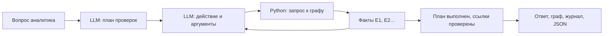

# Локальный LLM-агент аналитика

Это ограниченный агент с инструментами. Qwen3-1.7B получает вопрос, составляет план, выбирает действия и аргументы, читает вычисленные результаты и использует их в следующих запросах. Финальный ответ содержит ссылки на полученные факты. Роли и приоритеты рассчитываются прежними прозрачными правилами.

## Запуск

Нужен полный проект и CPython 3.11. Подготовка на macOS/Linux:

```bash
python3.11 scripts/setup_llm.py --download
sh run.sh --serve
```

Windows PowerShell:

```powershell
py -3.11 scripts/setup_llm.py --download
.\run.bat --serve
```

После готовности откройте адрес из терминала, затем «Аналитика и помощник» → «Помощник». Для реальной модели выбран режим «LLM-агент — локально, CPU», показано имя Qwen. `app/template.html` — исходник, его открывать не нужно. Автономный `output/graph.html` без сервера поддерживает быстрый поиск, но не запускает Python/LLM.

Скрипт скачивает 1,83 ГБ весов и сборку llama.cpp только при явном `--download`. Нормальный запуск работает офлайн. Если модель подготовлена после старта сайта, перезапустите сервер. Для другого порта: `--serve --port 8767`.

Сборки движка закреплены для Mac ARM/Intel, Windows x64 и Linux ARM64/x64. Это список подготовленных артефактов, не заявление об испытании всех ОС. Linux-сборка llama.cpp может требовать более новую glibc и системные библиотеки, чем основной Parquet-пайплайн; совместимость на целевом хосте нужно проверять отдельно. На неподдерживаемой системе основной анализ и быстрый поиск остаются доступны. Docker по умолчанию не содержит весов.

## Агентный цикл

1. Приложение проверяет вопрос, выбранный gid и отпечатки данных/анализа.
2. LLM составляет план до трёх типов проверок из восьми инструментов; для отсутствующих данных возвращает уточнение.
3. LLM выбирает действие и аргументы из оставшихся пунктов плана. Python возвращает точные факты с идентификаторами E1, E2 и далее.
4. Модель видит результаты: например, находит консолидатора, затем использует его gid для пути от seed и запроса недостающих данных. Точные строки gid ограничены вопросом, выбранным узлом и уже полученными фактами.
5. После выполнения плана модель завершает ответ, упорядочивая ссылки на факты. Приложение отклоняет неизвестные ссылки, пропущенные пункты плана и потерянные факты. Отображается исходный текст результатов инструментов.



Это agentic tool use с ограниченной автономией. Формат действий собственный; внешняя агентная платформа, облачный API или ключ оплаты не нужны. В интерфейсе видны действия и аргументы инструментов, а не скрытые рассуждения модели.

| Инструмент | Что возвращает |
|---|---|
| `top_nodes` | Приоритетные узлы с фильтром по роли |
| `node_details` | Метрики, правило роли и вклады рейтинга; сравнение нескольких gid |
| `shared_recipients` | Пересечение прямых получателей всех указанных отправителей, точные суммы |
| `neighbors` | Входящие/исходящие связи с направлением и суммами |
| `seed_paths` | Направленные пути от seed |
| `cluster_summary` | Размер, seed, потоки и гипотеза сообщества |
| `patterns` | Циклы, повторные FIFO-маршруты и аномальные сигналы |
| `missing_data` | Причины неполноты и предметные запросы дополнительных данных |

## Границы и контроль

- До шести вызовов LLM, включая план и завершение, и 150 секунд на запрос; одновременно один запрос. План содержит до трёх разных инструментов, каждый выполняется один раз. Для более широкого исследования нужны отдельные запросы. Исчерпание лимита помечается как частичный результат.
- Неизвестные инструменты, лишние аргументы, неверные gid и выдуманные ссылки отклоняются. Повтор идентичного запроса не создаёт новых фактов.
- Нет инструментов SQL, shell, внешнего поиска, произвольного чтения файлов или изменения данных. История решений аналитика не отправляется модели.
- Движок слушает случайный порт только на `127.0.0.1`, с ключом текущего процесса. HTTP-клиент игнорирует внешние proxy и не следует перенаправлениям. API сайта проверяет origin, тип JSON и специальный заголовок.
- CPU зафиксирован параметрами `--device none --n-gpu-layers 0 --no-kv-offload`. Контрольные суммы модели и файлов движка проверяются при старте.
- `dataset_sha256` связывает ответ с входом, `analysis_sha256` — с конкретными метриками/правилами. При устаревшей странице запрос отклоняется.
- Отсутствие выдуманных ссылок не доказывает полноту или полезность плана. Компактная модель может неправильно понять запрос. Нет основания приписывать узлу виновность, ФИО, ИИН или операции вне выборки.

## Проверка настоящей модели

Запустите сайт с готовой моделью. В другом терминале:

```bash
python3.11 scripts/evaluate_assistant.py --url http://127.0.0.1:8765
```

Windows: `py -3.11 scripts/evaluate_assistant.py --url http://127.0.0.1:8765`.

Семь сценариев выбирают gid из текущих результатов: приоритеты, сравнение плюс запрос данных, общий получатель пяти отправителей, приоритет плюс путь, граница depth4, неизвестный gid и запрос отсутствующих персональных данных. Отчёт `output/assistant_evaluation.json` сохраняет реальные действия, ответы, модель, время и результаты критериев. Это небольшой функциональный набор, не accuracy AML и не гарантия понимания произвольного языка.

Unit-тесты в `tests/test_assistant.py` отдельно проверяют арифметику инструментов, обработку выдуманных ссылок, повторов, ошибок и ограничения API. В этих тестах используется явно обозначенный тестовый двойник модели; успешный unit-тест не выдаётся за запуск LLM.

## Передача офлайн

После подготовки: `python3.11 tools/package_offline.py --with-llm` (Windows: `py -3.11 ...`). Архив содержит модель и движок текущей платформы. Не переносите `.venv`. Не добавляйте `.local_ai` в Git: веса превышают обычные ограничения размера файлов GitHub. Обычный исходный репозиторий воспроизводит основной анализ и содержит скрипт подготовки LLM, но не сами веса.

## Источники и лицензии

- [Официальная Qwen3-1.7B GGUF, Apache-2.0](https://huggingface.co/Qwen/Qwen3-1.7B-GGUF), ревизия `90862c4b9d2787eaed51d12237eafdfe7c5f6077`, Q8_0. [Копия лицензии](QWEN-LICENSE.txt) получена из официального репозитория Qwen/Qwen3-1.7B и включается в офлайн-архив.
- [llama.cpp b11125](https://github.com/ggml-org/llama.cpp/releases/tag/b11125), MIT; лицензия включена в архив движка.
- [Протокол сервера и структурированный JSON](https://github.com/ggml-org/llama.cpp/blob/master/tools/server/README.md).

Модель — общий языковой компонент. Никакие внешние атрибуты клиентов не добавляются; инструменты используют только граф хакатона и его вычисленные метрики.
